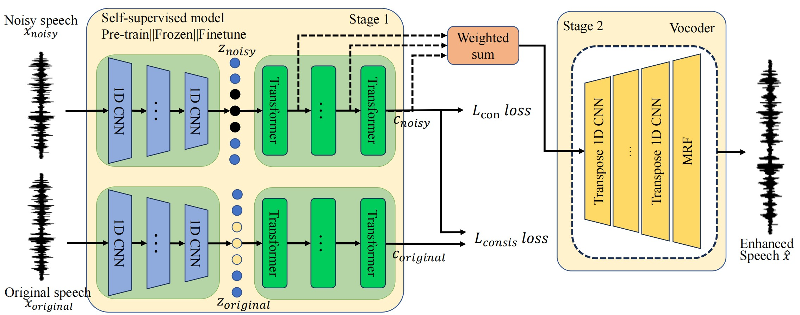

# 
 SERV: A Speech Enhancement Framework Based on Noise-augmented Self-supervised Representations and Vocoders

## Abstract

 Significant progress has been made in the field of speech enhancement in recent years, and most speech enhancement models denoise in either the time-frequency or time-domain; these methods rely on large amounts of paired clean-noisy speech data and may not generalize well on unseen noise types. Meanwhile, noise-augmented self-supervised representations can see more unlabeled data, showing strong denoising and generalization capabilities. How to more effectively
utilize self-supervised representations for speech enhancement remains an open and challenging problem. In this paper, we first propose SERV, a speech enhancement framework based on noise-augmented self-supervised representations and vocoders, where the self-supervised model learns the mapping from speech waveforms to representations. By combining contrastive and
consistency losses, the model learns noise-robust speech representations from large-scale noisy speech data. Second, in the fine-tuning stage, we build a vocoder that maps the learned representations back to speech and fine-tune the entire model using paired clean and noisy speech data. Finally, we conduct extensive experiments to evaluate the effects of different layers
of representations and various types of self-supervised models. The experimental results demonstrate that our proposed method achieves strong performance and generalization.

 

<body>

<h1>Ground Truth </h1>

<h3>
    <audio src="https://github.com/mmbluesky/mmbluesky.github.io/raw/main/ground_truth/p232_001.wav" controls="controls"></audio> 
    <audio src="https://github.com/mmbluesky/mmbluesky.github.io/raw/main/ground_truth/p232_002.wav" controls="controls"></audio> 
    <audio src="https://github.com/mmbluesky/mmbluesky.github.io/raw/main/ground_truth/p232_003.wav" controls="controls"></audio> 
    <audio src="https://github.com/mmbluesky/mmbluesky.github.io/raw/main/ground_truth/p232_005.wav" controls="controls"></audio> 
    <audio src="https://github.com/mmbluesky/mmbluesky.github.io/raw/main/ground_truth/p232_006.wav" controls="controls"></audio>
    <audio src="https://github.com/mmbluesky/mmbluesky.github.io/raw/main/ground_truth/p232_007.wav" controls="controls"></audio> 
    <audio src="https://github.com/mmbluesky/mmbluesky.github.io/raw/main/ground_truth/p232_009.wav" controls="controls"></audio> 
    <audio src="https://github.com/mmbluesky/mmbluesky.github.io/raw/main/ground_truth/p232_010.wav" controls="controls"></audio> 
    <audio src="https://github.com/mmbluesky/mmbluesky.github.io/raw/main/ground_truth/p232_011.wav" controls="controls"></audio>
    <audio src="https://github.com/mmbluesky/mmbluesky.github.io/raw/main/ground_truth/p232_012.wav" controls="controls"></audio>    
</h3>

 

<h1>Noisy speech </h1>

<h3>
    <audio src="https://github.com/mmbluesky/mmbluesky.github.io/raw/main/noisy/p232_001.wav" controls="controls"></audio> 
    <audio src="https://github.com/mmbluesky/mmbluesky.github.io/raw/main/noisy/p232_002.wav" controls="controls"></audio> 
    <audio src="https://github.com/mmbluesky/mmbluesky.github.io/raw/main/noisy/p232_003.wav" controls="controls"></audio> 
    <audio src="https://github.com/mmbluesky/mmbluesky.github.io/raw/main/noisy/p232_005.wav" controls="controls"></audio> 
    <audio src="https://github.com/mmbluesky/mmbluesky.github.io/raw/main/noisy/p232_006.wav" controls="controls"></audio>
    <audio src="https://github.com/mmbluesky/mmbluesky.github.io/raw/main/noisy/p232_007.wav" controls="controls"></audio> 
    <audio src="https://github.com/mmbluesky/mmbluesky.github.io/raw/main/noisy/p232_009.wav" controls="controls"></audio> 
    <audio src="https://github.com/mmbluesky/mmbluesky.github.io/raw/main/noisy/p232_010.wav" controls="controls"></audio> 
    <audio src="https://github.com/mmbluesky/mmbluesky.github.io/raw/main/noisy/p232_011.wav" controls="controls"></audio> 
    <audio src="https://github.com/mmbluesky/mmbluesky.github.io/raw/main/noisy/p232_012.wav" controls="controls"></audio> 
</h3>

<h1>MP-SENet </h1>

<h3>
    <audio src="https://github.com/mmbluesky/mmbluesky.github.io/raw/main/mpsenet/p232_001.wav" controls="controls"></audio> 
    <audio src="https://github.com/mmbluesky/mmbluesky.github.io/raw/main/mpsenet/p232_002.wav" controls="controls"></audio> 
    <audio src="https://github.com/mmbluesky/mmbluesky.github.io/raw/main/mpsenet/p232_003.wav" controls="controls"></audio> 
    <audio src="https://github.com/mmbluesky/mmbluesky.github.io/raw/main/mpsenet/p232_005.wav" controls="controls"></audio> 
    <audio src="https://github.com/mmbluesky/mmbluesky.github.io/raw/main/mpsenet/p232_006.wav" controls="controls"></audio>
    <audio src="https://github.com/mmbluesky/mmbluesky.github.io/raw/main/mpsenet/p232_007.wav" controls="controls"></audio> 
    <audio src="https://github.com/mmbluesky/mmbluesky.github.io/raw/main/mpsenet/p232_009.wav" controls="controls"></audio> 
    <audio src="https://github.com/mmbluesky/mmbluesky.github.io/raw/main/mpsenet/p232_010.wav" controls="controls"></audio> 
    <audio src="https://github.com/mmbluesky/mmbluesky.github.io/raw/main/mpsenet/p232_011.wav" controls="controls"></audio> 
    <audio src="https://github.com/mmbluesky/mmbluesky.github.io/raw/main/mpsenet/p232_012.wav" controls="controls"></audio> 
</h3>

<h1>SEMamba(+PCS) </h1>

<h3>
    <audio src="https://github.com/mmbluesky/mmbluesky.github.io/raw/main/semamba/p232_001.wav" controls="controls"></audio> 
    <audio src="https://github.com/mmbluesky/mmbluesky.github.io/raw/main/semamba/p232_002.wav" controls="controls"></audio> 
    <audio src="https://github.com/mmbluesky/mmbluesky.github.io/raw/main/semamba/p232_003.wav" controls="controls"></audio> 
    <audio src="https://github.com/mmbluesky/mmbluesky.github.io/raw/main/semamba/p232_005.wav" controls="controls"></audio> 
    <audio src="https://github.com/mmbluesky/mmbluesky.github.io/raw/main/semamba/p232_006.wav" controls="controls"></audio>
    <audio src="https://github.com/mmbluesky/mmbluesky.github.io/raw/main/semamba/p232_007.wav" controls="controls"></audio> 
    <audio src="https://github.com/mmbluesky/mmbluesky.github.io/raw/main/semamba/p232_009.wav" controls="controls"></audio> 
    <audio src="https://github.com/mmbluesky/mmbluesky.github.io/raw/main/semamba/p232_010.wav" controls="controls"></audio> 
    <audio src="https://github.com/mmbluesky/mmbluesky.github.io/raw/main/semamba/p232_011.wav" controls="controls"></audio> 
    <audio src="https://github.com/mmbluesky/mmbluesky.github.io/raw/main/semamba/p232_012.wav" controls="controls"></audio> 
</h3>

<h1>SERV Base </h1>

<h3>
    <audio src="https://github.com/mmbluesky/mmbluesky.github.io/raw/main/serv_base/p232_001.wav" controls="controls"></audio> 
    <audio src="https://github.com/mmbluesky/mmbluesky.github.io/raw/main/serv_base/p232_002.wav" controls="controls"></audio> 
    <audio src="https://github.com/mmbluesky/mmbluesky.github.io/raw/main/serv_base/p232_003.wav" controls="controls"></audio> 
    <audio src="https://github.com/mmbluesky/mmbluesky.github.io/raw/main/serv_base/p232_005.wav" controls="controls"></audio> 
    <audio src="https://github.com/mmbluesky/mmbluesky.github.io/raw/main/serv_base/p232_006.wav" controls="controls"></audio>
    <audio src="https://github.com/mmbluesky/mmbluesky.github.io/raw/main/serv_base/p232_007.wav" controls="controls"></audio> 
    <audio src="https://github.com/mmbluesky/mmbluesky.github.io/raw/main/serv_base/p232_009.wav" controls="controls"></audio> 
    <audio src="https://github.com/mmbluesky/mmbluesky.github.io/raw/main/serv_base/p232_010.wav" controls="controls"></audio> 
    <audio src="https://github.com/mmbluesky/mmbluesky.github.io/raw/main/serv_base/p232_011.wav" controls="controls"></audio> 
    <audio src="https://github.com/mmbluesky/mmbluesky.github.io/raw/main/serv_base/p232_012.wav" controls="controls"></audio> 
</h3>

<h1>SERV Large </h1>

<h3>
    <audio src="https://github.com/mmbluesky/mmbluesky.github.io/raw/main/serv_large/p232_001.wav" controls="controls"></audio> 
    <audio src="https://github.com/mmbluesky/mmbluesky.github.io/raw/main/serv_large/p232_002.wav" controls="controls"></audio> 
    <audio src="https://github.com/mmbluesky/mmbluesky.github.io/raw/main/serv_large/p232_003.wav" controls="controls"></audio> 
    <audio src="https://github.com/mmbluesky/mmbluesky.github.io/raw/main/serv_large/p232_005.wav" controls="controls"></audio> 
    <audio src="https://github.com/mmbluesky/mmbluesky.github.io/raw/main/serv_large/p232_006.wav" controls="controls"></audio>
    <audio src="https://github.com/mmbluesky/mmbluesky.github.io/raw/main/serv_large/p232_007.wav" controls="controls"></audio> 
    <audio src="https://github.com/mmbluesky/mmbluesky.github.io/raw/main/serv_large/p232_009.wav" controls="controls"></audio> 
    <audio src="https://github.com/mmbluesky/mmbluesky.github.io/raw/main/serv_large/p232_010.wav" controls="controls"></audio> 
    <audio src="https://github.com/mmbluesky/mmbluesky.github.io/raw/main/serv_large/p232_011.wav" controls="controls"></audio> 
    <audio src="https://github.com/mmbluesky/mmbluesky.github.io/raw/main/serv_large/p232_012.wav" controls="controls"></audio> 
</h3>

